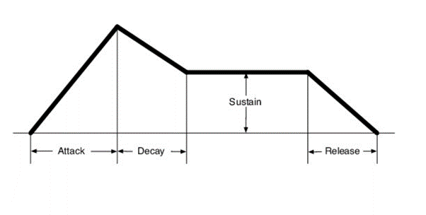

# Exercise: Creating Synthetic Ocean Wave Sound in Praat Using Noise and ADSR

The purpose of this exercise is to create a synthetic ocean wave sound effect by modulating the amplitude of noise. This will involve generating noise, modifying its spectrum, applying a low-pass filter, and shaping its amplitude with an ADSR envelope.

## Step-by-Step Instructions

Complete each step manually in Praat's GUI to understand the effect of each transformation. Only the step for creating the ADSR envelope will be completed using a script. This hands-on approach will help you grasp the fundamentals of sound modulation and synthesis in Praat.

### Generate White Noise
1. In Praat, go to `New` → `Sound` → `Create Sound from formula...`
2. Set the name to `white_noise`, duration to `10 seconds`, and sampling frequency to `44100 Hz`.
3. Use the following formula for generating white noise:
    ```praat
    randomUniform(-0.99, 0.99)
    ```
    The function `randomUniform(lower, upper)` generates random numbers between `lower` and `upper`.
4. Click `OK` to create the white noise.

### Convert White Noise to Pink Noise
1. With the white noise selected, go to `Analyse spectrum` → `To Spectrum...` to transform the sound into its spectral representation.
2. Next, go to `Modify` → `Formula...`
3. In the `Formula` field, use the following code to modify the spectrum of the noise:
    ```praat
    if x > 100 then self * sqrt(100/x) else 0 fi
    ```
4. Click `OK`. This formula attenuates higher frequencies, transforming the white noise into pink noise.
5. Finally, to convert the modified spectrum back to the actual sound of pink noise, go to `Sound` → `To Sound`.

### Apply a Low-Pass Filter
1. Select the pink noise you created in the previous step.
2. Go to `Filter` → `Pass Hann band...`
3. Set the frequency range as desired (e.g., `0 Hz` to `8000 Hz`) to filter out high frequencies, creating a softer, wave-like sound.
4. Click `OK` to apply the low-pass filter.

### Create an ADSR Envelope and Listen to the Result

Before applying the ADSR envelope, it’s helpful to understand what an ADSR envelope is and how it shapes the amplitude of a sound.

#### What is ADSR?
An **ADSR envelope** represents four phases in the amplitude shaping of a sound:
- **Attack** – Time taken for the sound to reach its peak from silence.
- **Decay** – Time taken to reach a steady stater or "sustain level" from the peak.
- **Sustain** – The amplitude level that is maintained for a certain duration after the initial changes in the attack and decay phases.
- **Release** – Time taken to fade out to silence after the sustain phase ends.



The ADSR envelope helps give a sound its dynamic shape over time.

#### Modulating the Noise with an ADSR Envelope
1. In Praat, create a new script to generate an ADSR envelope that modulates the amplitude of the filtered pink noise.
2. Paste the following code into the script editor in Praat.

    ```praat
    # ADSR envelope creation in Praat

    # Parameters for ADSR
    attackTime = 6   
    decayTime = 2    
    sustainLevel = 0.4 
    releaseTime = 2  
    totalDuration = 10 

    # Create an amplitude modulation using ADSR
    Create AmplitudeTier: "ADSR", 0, totalDuration

    # Attack phase
    Add point: 0, 0
    Add point: attackTime, 0.7

    # Decay phase
    Add point: attackTime + decayTime, sustainLevel

    # Sustain phase
    Add point: totalDuration - releaseTime, sustainLevel

    # Release phase
    Add point: totalDuration, 0
    ```

3. After running the script, you will have an amplitude tier named `ADSR`.
4. To apply this ADSR envelope to the filtered pink noise, select both the amplitude tier and the noise, then click `Multiply`.
5. Play the resulting sound to listen to the ocean wave effect created. Adjust the ADSR parameters or filter settings to further shape the sound as desired.

### Experiment with Different Envelopes

In this step, you will observe and experiment with various ADSR envelope shapes. Below are four different ADSR envelope configurations:


1. Study the four different ADSR envelopes in the figure. Note that there are no exact values for the parameters in the figure, so use visual inspection to estimate reasonable values for each ADSR parameter (e.g., `attackTime`, `decayTime`, `sustainLevel`, `releaseTime`) that would match each envelope's shape.
2. Modify the parameters in the Praat script (e.g., `attackTime`, `decayTime`, `sustainLevel`, `releaseTime`) to simulate each envelope shown in the figure.
3. After simulating each envelope, use it to modulate the noise (following the previous steps) to create a new sound. You will create four new sounds, each corresponding to one of the envelopes in the figure.
4. Listen to the resulting sounds to observe how changes in the ADSR parameters affect the sound’s characteristics.
5. Submit each sound as part of your task, and for each sound, explain how the overall shape of the sound is influenced by each ADSR parameter (attack, decay, sustain, release).
